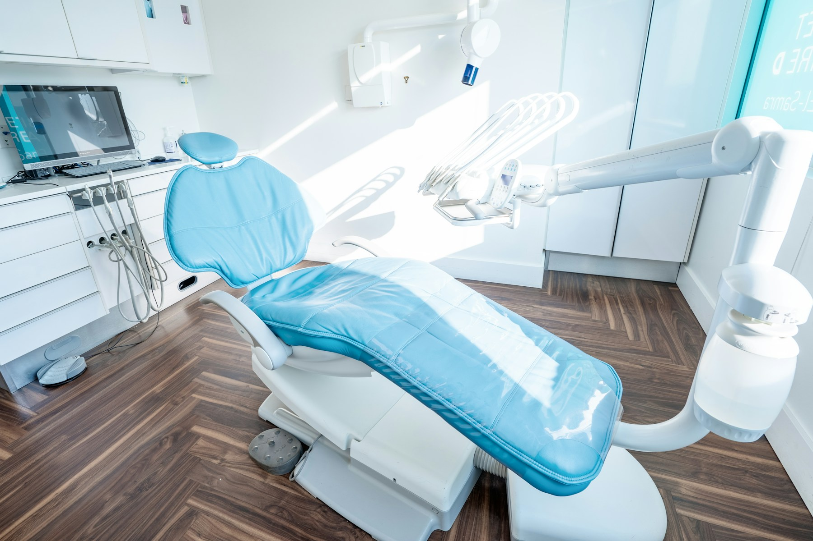

# Complete Dental Studio Premium Website

Premium, responsive dental clinic website for **Complete Dental Studio** and **Dr. Nikita Rawat Jain**, deployed using GitHub Pages.

## Live Website

[](https://satitech-official.github.io/complete-dental-studio-premium-website/)

### Click the clinic preview to open the website

[](https://satitech-official.github.io/complete-dental-studio-premium-website/)

**Live URL:**  
https://satitech-official.github.io/complete-dental-studio-premium-website/

> This repository is configured for GitHub Pages. Vercel is not used.

## Highlights

- Premium dental-clinic UI with responsive layouts.
- Complete pages for clinic profile, doctor, treatments, gallery, FAQs, blogs, contact and appointment booking.
- Local clinic and dental images from `public/images` for reliable loading.
- GitHub Pages-safe asset paths, routing, metadata and social preview.
- Appointment and contact forms validate details and open a prepared WhatsApp inquiry.
- Static treatment routes generated during the production build.
- `.nojekyll` and fallback routing support included.

## Technology Stack

- Next.js with JavaScript
- Tailwind CSS
- Framer Motion and GSAP
- React Hook Form with Zod validation
- Swiper and React Compare Slider
- Lucide React icons
- GitHub Actions and GitHub Pages

## Run Locally

```bash
npm install
npm run dev
```

## Production Build

```bash
npm run build
```

The GitHub Pages-ready static site is generated in the `out` directory.

## Automatic Deployment

The workflow is located at:

```text
.github/workflows/deploy-pages.yml
```

Every push to the `main` branch builds and deploys the website automatically.

## Important Content Notes

Clinic credentials, reviews, ratings, memberships, treatment outcomes and patient media should only be published after verification and approval. Replace reference media with consented clinic-owned assets before a final medical production launch.

## QA Checklist

- Navigation and treatment routes open correctly.
- Images load from the GitHub repository path.
- Mobile menu and interactive sections work.
- Appointment and contact forms open WhatsApp without server errors.
- Call, WhatsApp, Instagram and map links work.
- Sitemap, robots and metadata build successfully.
- No Vercel dependency is required.
